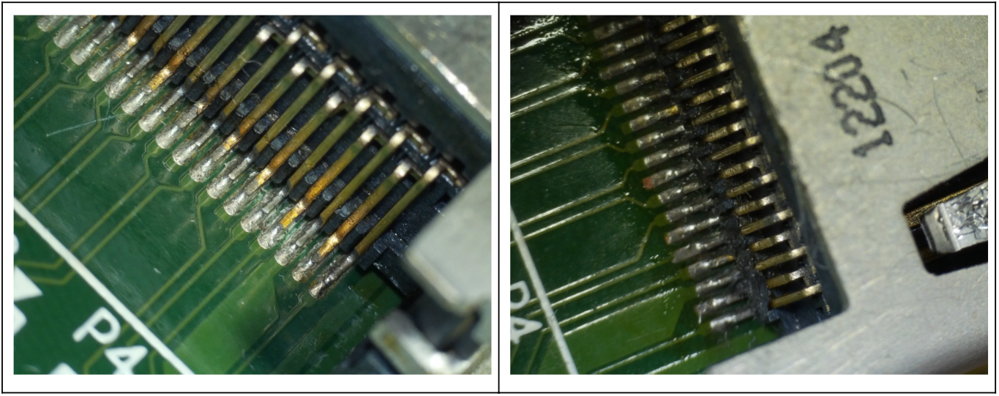

#### Falla de video HDMI

La consola comenzó a perder la señal de video HDMI gradualmente, iniciando por pequeños lapsos de menos de 1 segundo, para terminar por perderla completamente, mostrando únicamente pantalla negra en la TV.  También hemos notado que la falla no se presenta en la salida de video analógico (YPbPr - video componente) ni tampoco en la pantalla del gamepad Wii U.

Buscando por internet casos similares a nuestro problema vimos que la falla suele apuntar como responsable al chip **Panasonic MN864718 controlador HDMI del Wii U**, señalado en recuadro color rojo en la siguiente imagen de la motherboard. Aunque también se puede dar el caso de que la falla se encuentre en el conector HDMI ubicado exactamente a la derecha del chip Panasonic en la imagen.

Para determinar la ubicación de la falla debemos hacer pruebas básicas para descartar que el problema se encuentre efectivamente en la consola.
1. Limpiamos con alcohol isopropílico los conectores HDMI de consola Nintendo Wii U, pantalla de TV y de los propios cables HDMI. 
2. Probamos la consola Wii U con diversos cables HDMI de diferentes calidades y con todos se percibe la falla, por lo cual podemos descartar que la falla sea debido al cable. 
3. Posteriormente probamos en diversos monitores o pantallas de televisión HDMI y también en todas se presenta la falla, por lo que podemos asegurar que la falla no está en los dispositivos externos y que se encuentra en la propia consola Nintendo Wii U. Aunque debo reconocer que algunas pantallas (p.ej.LG) la falta de señal no demora demasiado en regresar y suele permitir seguir jugando. Cuando en otras (Samsung) la imagen tarda mas en regresar e incluso puede no hacerlo imposibilitando seguir jugando.
4. Por último debemos asegurarnos de que la falla solo se presente en la salida de video HDMI, probando la consola utilizando la salida de video analógico (p.ej. con cable de video componente Y Pb Pr)

Para continuar con nuestro diagnóstico debemos tener acceso al interior de la consola, por lo cual debemos desarmarla.

#### Guía para desarmar la consola
En la red existen una gran cantidad de tutoriales en texto y video que nos muestran con lujo a detalle el como desarmar la consola Nintendo Wii U, por lo cual no profundizaremos en este punto y solo seguimos cada paso indicado en la guía publicada en el siguiente sitio.[ifixit](https://es.ifixit.com/Desmontaje/Nintendo+Wii+U+Teardown/11796)

Una vez expuesta la motherboard principal de la consola, el siguiente paso fue revisar el conector HDMI, en el cual notamos que la humedad hizo que los conectores del socket se vean de un color oscurecido y no del color dorado característico. Por lo tanto le dimos una limpieza con cepillo de fibra de vidrio, alcohol isopropílico y aún quedó como se ve en la imagen siguiente. 

Lamentablemente no es fácil revisar el conector HDMI hembra donde recibe el cable y tampoco es fácil darle una limpieza a profundidad debido a la incomodidad que presenta. Aun así hicimos lo propio tratando de remover la mayor cantidad de suciedad que pudiera tener. Probamos el sistema y la falla sigue presente. 

También revisamos que los conectores estuvieran bien soldados y libres de corrosión tanto del conector HDMI como del controlador HDMI, el chip Panasonic MN864718. Posteriomente probamos el sistema, solo para confirmar que la falla no ha desaparecido y por tanto no se debe a suciedad. 

Por lo cual hicimos una renovación de soldadura en el conector HDMI para fortalecer el contacto entre los pines y la PCB evitando así un posible falso contacto por estres mecánico al conectar el cable HDMI. También hicimos reflow al chip Panasonic con la misma intensión de descartar falso contacto.

Al no encontrar fallas visiblemente evidentes decidimos hacer el reemplazo del conector HDMI y del chip Panasonic MN864718, y tras estos cambios el problema se redujo pero definitivamente no desapareció, y eventualmente volvió a fallar de la misma manera que antes. Por lo cual nuestra opción para seguir usando la consola es mediante la salida de video analógica (Y Pb Pr - Video Componente) hasta encontrar una solución al problema.

Al revisar nuevamente , vemos que entre el chip Panasonic encargado de la salida de video HDMI y el propio conector HDMI se encuentran algunos componentes que no teniamos identificados. Pero tras buscar en internet pudimos encontrar un video con diagnostico y reparación de esta falla en este [enlace](https://www.youtube.com/watch?v=UZzMNiNcBXk) y se indica que se trata de un par de bobinas de filtrado para reducir ruido en la señal HDMI.

En este caso cada una de estas bobinas admite 4 entradas y sus correspondientes salidas. Por lo tanto controlan el flujo de señales en 8 pistas que interconectan con un par de chips ubicados en DA5 y DA8 que a su vez conectan con el puerto HDMI. Si alguna de estas bobinas tiene un fallo, es decir que se abre o entra en corto no permite circular la señal correctamente y puede dañar al chip Panasonic MN864718.

Al medir continuidad con multímetro en cada una de las terminales de entrada y su correspondiente salida notamos que una de sus terminales no había continuidad, mientras que en  todas las demás si se tenía. Por este motivo se debe reemplazar el componente dañado. En nuestro caso el identificado como CM8

Lamentablemente no tenemos el diagrama esquemático de la consola Nintendo Wii U, por lo cual tampoco tenemos acceso a la lista de componentes y por ende no podemos identificar con precisión a que componente se refiere CM8.  Visualmente tampoco pudimos identificar el número de parte, pues no tiene nomenclatura inscrita. Pero por tamaño y función el [DLP2ADN900HL4](https://www.digikey.com/es/products/detail/murata-electronics/DLP2ADN900HL4L/1927936) parece ser el indicado, aunque también en el sitio donde se diagnostica esta falla, me enteré que se puede utilizar la bobina del puerto HDMI de un PS4, la cual se puede conseguir relativamente fácil.

Para este caso de bobinas para puerto HDMI de PS4 hay un par de detalles a considerar, ya que esta pieza de reemplazo solo viene en circuitos con 2 entradas/salidas, por lo cual para cambiar el circuito dañado CM8 de Wii U se requieren instalar 2 bobinas en lugar de una sola para cubrir las 4 entradas/salidas.

El otro detalle es que la pieza de PS4 viene de un tamaño superior al de Wii U, lo que dificulta la instalación de los mismos en la PCB. Sin embargo las bobinas para HDMI de PS4 PRO son del mismo tamaño que utiliza Wii U. También debo mencionar que este tipo de bobinas smd tienen sus conectores para soldar únicamente por la parte inferior, lo que hace difícil su instalación si no se tiene el equipo y la experiencia para hacerlo. 

En la siguiente imagen extraida del sitio oficial del fabricante se muestra la función de estas bobinas de filtrado   [www.murata.com](https://www.murata.com/en-global/products/emc/emifil/cmcc/effect2) y que se titula [Noise suppression effects of common mode choke coils in HDMI interfaces](https://www.murata.com/en-global/products/emc/emifil/cmcc/effect2)
    

Al remover las bobinas, debemos revisar que el chip Panasonic MN864718 no se encuentre en corto circuito en las mismas terminales donde se conectan las propias bobinas. Si se detecta corto entonces debe reemplazarse también el chip MN864718, ya que si no hacemos el reemplazo es muy probable que las bobinas vuelvan a fallar al energizar el sistema.

Debo mencionar que antes de reemplazar las bobinas, la consola fallaba en emitir señal por el puerto HDMI casi de inmediato. Bastaba solo con dejar la consola prendida sin ingresar a juego y en cuestión de algunos segundos comenzaba a perder señal para después volverse muy frecuente la intermitencia. Por este motivo solo se podía utilizar con cable de video componentes.

Una vez reemplazadas las bobinas , volvemos a revisar continuidad para confirmar que todo funciona correctamente, ya que este tipo de componentes es muy sensible al calor y puede dañarse al soldarlo en la PCB. Una vez finalizada la revisión ya podemos ensamblar la consola y probar su funcionamiento. Aunque en nuestro caso debemos atender el segundo problema que aqueja a la consola y que hasta este momento imposibilita su funcionamiento.

##### Pasos a seguir para diagnosticar la pérdida de señal por HDMI 1080p

En resumen si se tiene esta falla de pérdida de señal HDMI lo recomendable es:

1. Limpiar conectores HDMI de consola Wii U, cable y pantalla de TV o monitor.
2. Comprobar con diferentes cables y con diferentes pantallas para asegurarnos de que la falla se encuentra en la consola.
3. Revisar si el conector HDMI esta en buen estado, es decir sin pines doblados o con corrosión, óxido o suciedad excesiva.
4. Confirmar que la falla solo suceda en la salida HDMI. Es decir, que Nintendo Wii U funcione correctamente con la salida de video analógica.
5. Desarmar la consola y revisar pines del chip Panasonic MN864718 y del puerto HDMI buscando que no se tenga falso contacto en pines.
6. Revisar continuidad en las bobinas CM7 y CM8. Esta medición debe hacerse en los conectores de la bobina en línea a las pistas que lo conectan.

En cualquiera de los casos anteriores, si se detecta una falla hacer los cambios correspondientes para solucionar el problema.

#### Código de error 160-1400

Como se mencionó al inicio de este documento, tiempo después de estar utilizando la consola por la salida analógica se sumó una nueva falla, ahora la consola presenta un problema con la unidad óptica. Específicamente se tiene el código de error: 160-1400, el cual no permite ingresar a la pantalla de menú y selección de juegos.

Esta falla imposibilita totalmente jugar, ya que aparece el mismo mensaje en el Wii U Gamepad. Tras investigar un poco sobre esta falla, encontramos que se debe a un problema de conexión con la unidad óptica y no precisamente de lectura.

Ésta falla curiosamente involucra también bobinas de filtrado EMI pero que específicamente se encuentran en la línea de conexión con el conector flex de la unidad óptica. 
Este comportamiento podría indicar un problema de fabricación con este tipo de componentes en las consolas Wii U, ya que cada vez es mas frecuente ver este tipo de fallas en consola Nintendo Wii U.

En este caso la falta de continuidad se encontró en una línea que conecta con CM10, por lo cual fue reemplazado por la pieza correspondiente. Como se puede ver en esta ocasión se trata de una bobina de 4 pines solamente contra la de 8 que se tenía en el puerto HDMI. Por lo que la pieza adecuada por función y tamaño es **DLP11SA900HL2L** que se puede conseguir en [www.digikey.com](https://www.digikey.com/es/products/detail/murata-electronics/DLP11SA900HL2L/2590151) . La bobina para PS4 que se alcanza a ver en la parte superior de la imagen anterior también funciona pero pueden ver la diferencia en tamaño lo que dificulta su instalación además de que la frecuencia de corte comienza hasta 10 GHz cuando la bobina del tamaño adecuado  es de 6 GHz. Esto solo podría afectar cuando la señal que circula por el elemento tenga ruido fuera del rango de protección ocasionando en el peor de los casos pérdida de la señal momentánea o en este caso de la unidad óptica podría ocasionar error de lectura.

Tras el reemplazo de las piezas y la comprobación de continuidad en todas las bobinas, se ensambla nuevamente la consola y se prueba. 

Afortunadamente tras la reparación vemos la señal mediante la salida HDMI sin intermitencias, lo que hasta este momento nos indica que al menos esta parte funciona correctamente, posteriormente notamos que el error en pantalla 160-1400 ha desaparecido y podemos ingresar correctamente hasta el menú principal. Configuramos la salida HDMI a 1080p por defecto e insertamos un juego en la unidad óptica, y todo funciona bien.

Un mes después y con varias sesiones de juego como prueba no hemos detectado que la señal HDMI falle ni tampoco tenemos problemas con la unidad óptica. Por lo cual podemos declarar como una reparación exitosa.

###### @Spacemx