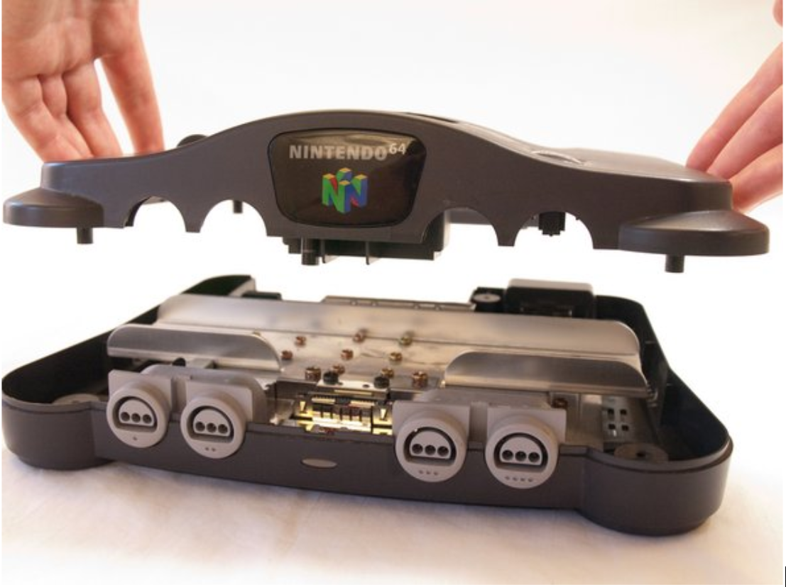
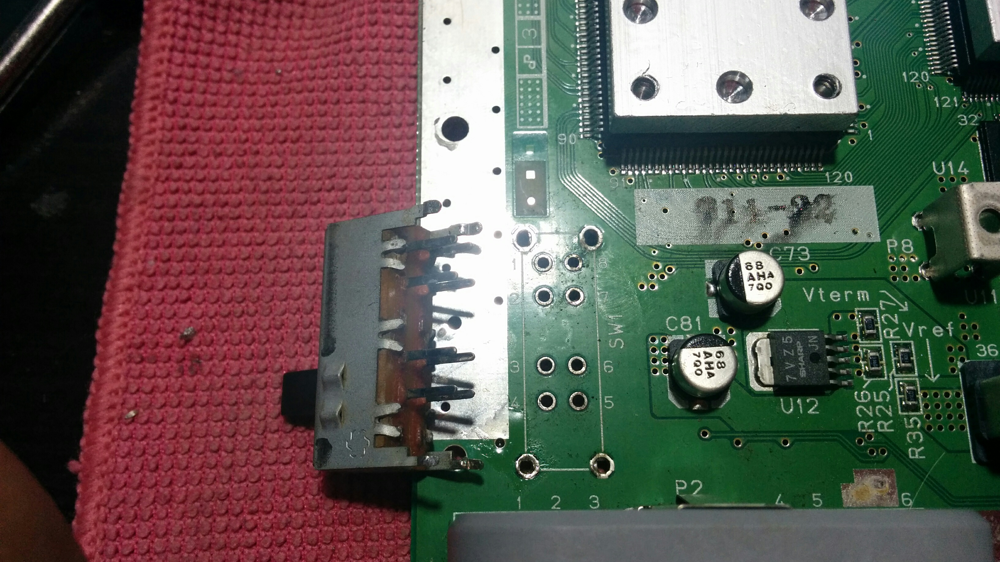
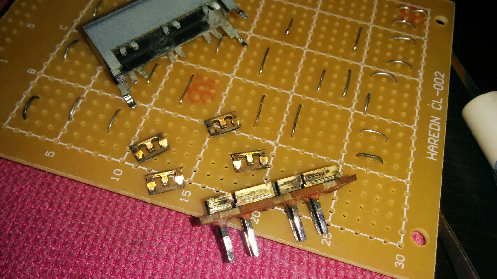
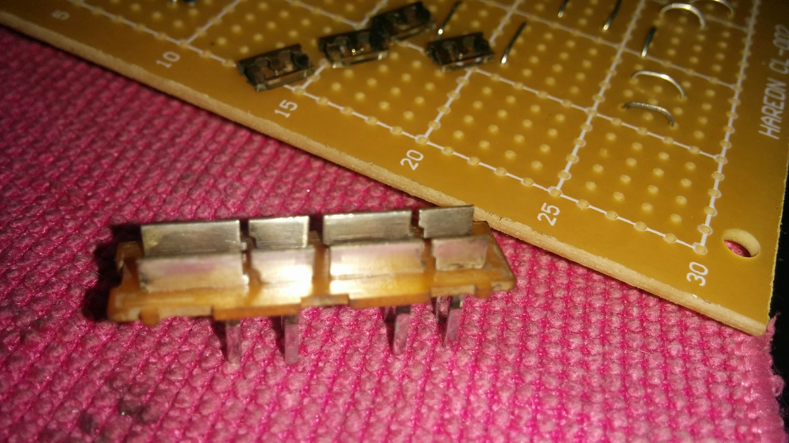
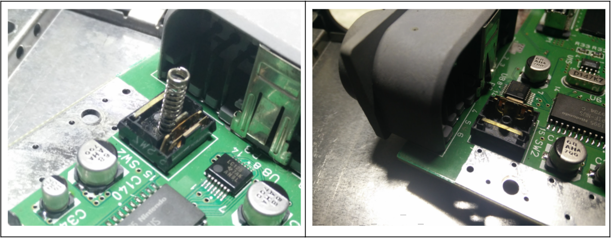
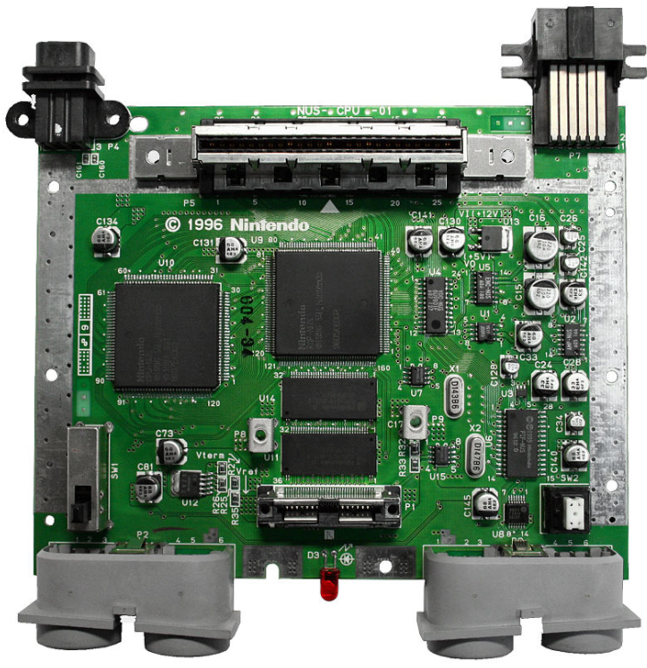
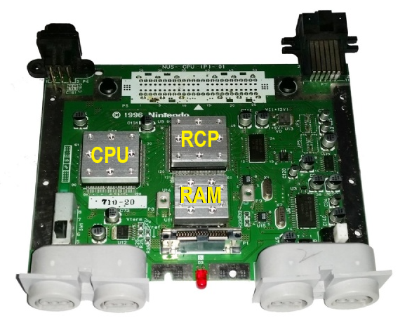
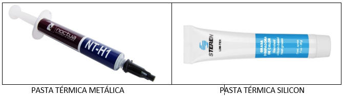
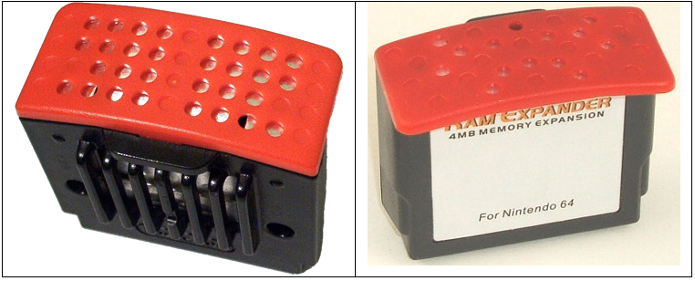

#### Descripción del problema

##### El sistema se reinicia aleatoriamente durante el juego. 

Este problema es común en consolas Nintendo 64 pero las razones que la ocasionan puede ser muy diversas,  desde suciedad en los sockets o cartuchos hasta problemas de sobrecalentamiento.

Por este motivo aplicaremos algunas acciones tratando de eliminar el problema por completo para no tener que abrir múltiples veces las consola hasta encontrar el causante de la falla. De cualquier manera podemos considerar que estas acciones son de mantenimiento preventivo que solo afectan de manera positiva al funcionamiento de la consola.

#### Causas comúnes

1. La primera opción se refiere a un problema con el interruptor de encendido (Power ON/OFF button). Pues en algunas consolas al deslizar ligeramente el interruptor de encendido y dejarlo en una posición intermedia entre OFF/ON se puede jugar sin problemas. Es decir no deslizarlo completamente a posición ON, solo moverlo hasta que el led indicador de la consola encienda.
2. La segunda opción indica falso contacto en el propio botón “reset”.
3. La tercera opción es que el problema se debe a un falso contacto del socket que recibe los cartuchos.
4. La cuarta opción menciona que el problema se debe al sobrecalentamiento de la consola. 
5. Otras razones que pueden ocasionar el problema de reseteo y que no atenderemos en esta ocasión se refieren a falla en la fuente de poder o en el módulo de memoria "expansion pak"

#### Guía para desarmar la consola Nintendo 64

Éste proceso es bastante simple y directo, solo hay que tener la herramienta adecuada (desarmador gamebit), aunque si tienen dudas, éste procedimiento está perfectamente documentado en texto, imágenes y videos que se pueden encontrar fácilmente en internet. Motivo por el cual no atenderemos esta parte en nuestro documento de reparación. [Aqui un enlace que pueden consultar](https://es.ifixit.com/Gu%C3%ADa/Nintendo+64+Bottom+Cover+Disassembly/1611?lang=en)

#### Limpieza interna a interruptor de encendido ON/OFF

Para dar limpieza interna en el botón se recomienda desoldarlo de la tarjeta y abrirlo para tener acceso al mecanismo interno del propio botón. Para ello primero debemos desensamblar la consola Nintendo 64

Una vez que tenemos acceso a la motherboard de la consola procedemos a desoldar el interruptor y posteriormente a abrirlo doblando las pequeñas pestañas metálicas que sujetan la carcasa del propio interruptor deslizable.

Al removerlo notamos que internamente se tienen dos láminas de cobre a manera de guía o riel, las cuales presentan cierto grado de suciedad o corrosión la cual sin duda hace que la conductividad sea menor que la adecuada.

Hacemos limpieza de ambos rieles, utilizando el pincel de fibra de vidrio, utilizado para limpiar joyería, y posteriormente hacemos lo mismo con las pequeñas láminas conductoras que se sujetan al botón del interruptor deslizable. Esto para que ambos conectores tengan la mejor conductividad posible.

Una vez terminada la limpieza se ensambla el interruptor y lo soldamos en su ubicación para proceder a nuestra siguiente acción de mantenimiento.

#### Limpieza a botón de reset

Para tener acceso al botón de reset debemos remover su carcasa de plástico que lo protege,  y para ello usaremos una aguja o pequeño desarmador para mover unas pequeñas pestañas que sujetan la carcasa.

Una vez desarmado aplicamos alcohol isopropílico o líquido limpiador de contactos y con un cepillo suave tallamos los conectores metálicos. Posteriormente volvemos a ensamblar y continuamos con el mantenimiento.

#### Limpieza de conector o socket de cartuchos

Para limpiar este socket se puede remover fácilmente, pues no se encuentra soldado, solo debemos moverlo ligeramente y literalmente arrancarlo de la PCB principal. Usamos alcohol isopropílico y limpiamos los orificios que alojan el socket en la PCB y también limpiamos los pines y conectores del propio socket. 

Para el socket usaremos una tarjeta de plástico con un paño de tela muy ligera, como el que se usa para limpiar anteojos, humedecido en alcohol y lo insertamos varias veces en la ranura para el cartucho.

#### Sobrecalentamiento de la consola

Para determinar que el problema de reinicio constante en nuestra consola Nintendo 64 se debe a sobrecalentamiento, podemos remover el disipador grande y revisar que la pasta que une a los pequeños dispadores con los chips se encuentre en buen estado, es decir que no esté extremadamente seca, si se da el caso entonces hay que cambiar la pasta térmica. 

Aprovechando que tenemos desmontado el disipador grande y expuestos los disipadores de CPU, RCP (Reality Co-Processor) y memorias RAM, tal y como se puede observar en la imagen  anterior,  podemos probar la consola por algunos minutos con un juego para  ir censando la temperatura de cada uno de ellos (algunos multímetros incluyen un termopar para esa función o también pueden usar un termómetro infrarrojo o una cámara térmica) para detectar si alguno de ellos se sobrecaliente rápidamente por arriba de los 60°C. 
Si la falla de reinicio se debe a la temperatura entonces deberíamos ver un incremento de temperatura muy rápido en los chips de la consola.

En mi caso detecté que uno de los 3 disipadores el del CPU pequeños alcanzó un máximo de 60° C  al cabo de 30-40 minutos de juego y los otros 2 no llegaron a ese valor. Debo mencionar que al instalar el dispador grande que conecta con los 3 disipadores pequeños la temperatura censada nunca sobrepasó los 40° C.

En mi consola la pasta térmica original que hace contacto entre el chip (CPU, RCP o RAM) y el disipador se encuentra en buen estado pues transfiere correctamente la temperatura al disipador de lo contrario se debe cambiar por una pasta térmica metálica especial para procesadores. 
 
 

La pasta térmica metálica esta basada en una especie de silicona a la que se le añaden metales como aluminio o plata que ofrecen una conductividad térmica mucho mayor que la cerámica. Son más caras, pero ideales para soportar las altas temperaturas de un procesador.

Para mejorar la transferencia de calor entre los disipadores de aluminio pequeños y el grande apliqué pasta térmica de silicon genérica (de la que se usa para transistores y otros circuitos electrónicos), pues originalmente solo hacen contacto directo entre ellos gracias a unos tornillos que los unen.

Afortunadamente, estas cuatro acciones lograron eliminar el problema de reseteo en mi consola por completo, pues llevo varias sesiones de juego en las pasadas 3 semanas cambiando cartuchos y jugando por varias horas y no se ha reiniciado la consola ni una sola vez.

Para finalizar y como dato adicional, otra opción que se deben considerar con el problema de reseteo se refiere al "expansion pak", el cual suele fallar especialmente si se trata de una versión no oficial. Puede darse mantenimiento limpiando conectores con alcohol isopropílico y cepillo tanto en el socket que lo aloja como en el propio módulo de memoria.

Y por último también la falla puede ocasionarse por problemas de alimentación de energía lo cual puede derivar en problemas con la fuente de poder. Por esto se recomienda conectar la consola con regulador de voltaje o supresor de picos. Si la falla se encuentra en la fuente de poder lo mas probable es que la consola no encienda por completo, pero si solo se resetea puede deberse a sobrecalentamiento y con limpieza interna de la fuente y sus conectores puede solucionarse. También se debe considerar reemplazar los capacitores que se encuentren  inflados o derramados así como también revisar que ningun otro componente se encuentre quemado. Afortunadamente yo no tuve ese problema y no fue necesario aplicar estas acciones.

###### @Spacemx