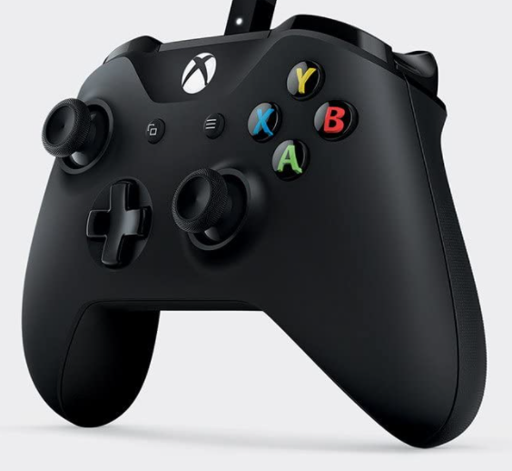
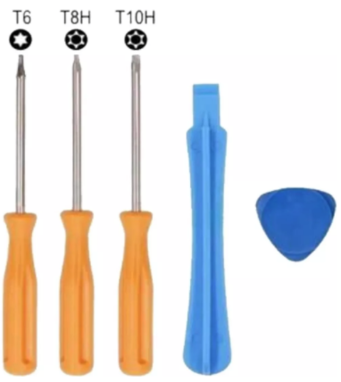
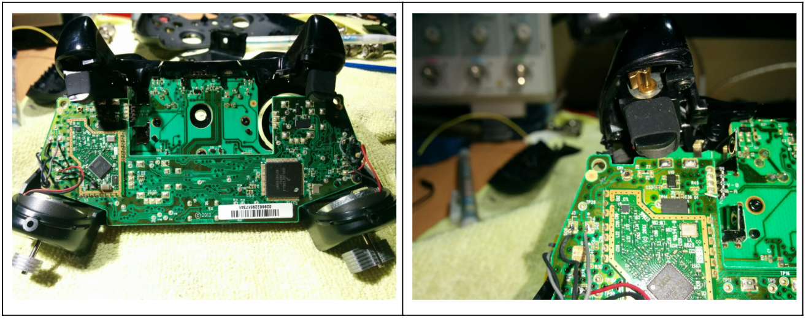
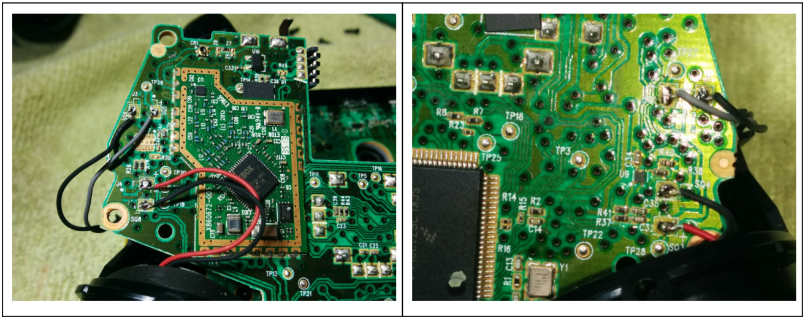
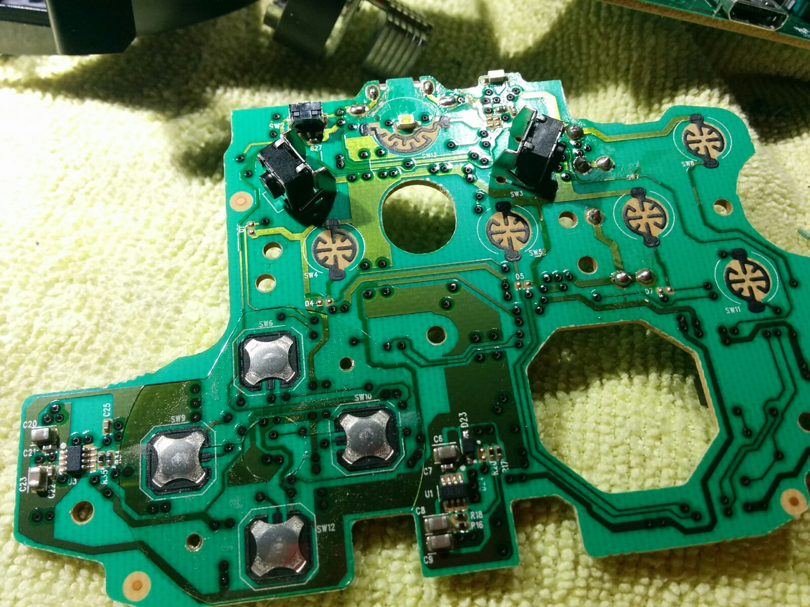
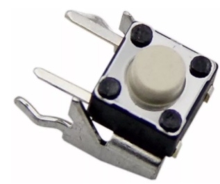

#### Descripción del problema

Se detecta una falla en botón L de control Xbox One (Gamepad). Al investigar la manera de abrir el control para llegar hasta el botón L (push button) y darle mantenimiento, notamos que el procedimiento es muy laborioso y se requiere incluso desoldar algunos cables para poder desarmarlo en su totalidad. 

Debido a esto, decidimos no dar mantenimiento de limpieza y hacer el reemplazo del botón L para evitar fallas. Pues en muchas ocasiones una simple limpieza y mantenimiento de los botones sólo garantiza su funcionamiento durante un periodo de tiempo y eventualmente puede llegar a fallar.

Por lo tanto compramos los botones de repuesto para botones L y R y hacemos el reemplazo de ambos. Pues al fallar el botón L hay posibilidades de que el botón R también esté a punto de fallar. Y para evitarnos el problema de desarmar nuevamente el control entonces reemplazamos ambos en esta ocasión.

Además el costo de los botones es muy barato.

##### Desarmando el control

Para desarmar el control se requiere tener a la mano desarmadores TORX (también conocidos como de tipo estrella) con bit de seguridad. Es decir el pequeño hueco en la propia punta de la estrella. Y también algunas espátulas de plástico o desarmadores planos para remover la parte inicial de la carcasa del propio control.

Para abrir el control pueden seguir alguna guía en video especificando claramente cada paso a seguir para no romper nada y llegar hasta la placa que tiene instalados los push buttons L y R. 

Llegar hasta la parte que se ve en las imágenes anteriores no es tan complicado, pero aún no tenemos acceso a los botones L y R. por lo cual debemos seguir desarmando.

En las imágenes anteriores vemos cuatro cables en cada extremo del control, los cuales debemos desoldar para poder seguir desarmando nuestro control. Para ello tomamos una fotografía del lugar donde van conectados para tener la referencia que nos ayude a colocarlos en su lugar una vez que terminemos nuestra reparación y debamos ensamblar el control nuevamente.

Al remover los cables debemos separar las 2 tarjetas que conforman el control. Es relativamente facil hacerlo pues se conectan mediante un socket intermedio.

En la placa inferior (la de mayor tamaño) podemos ver los botones L y R en su parte posterior.

Cada push button tiene cuatro pines de conexión que debemos desoldar.

Instalamos los nuevos botones en su lugar cuidando que la base de los push buttons quede perfectamente insertada sobre la placa sin dejar espacio entre la placa y el botón. Pues el mecanismo que activa los botones es muy preciso y puede no llegar a funcionar bien, si el push button no se encuentra en su lugar correcto. Es decir debemos insertar el botón al máximo y que quede totalmente pegado a la placa antes de soldarlo en su posición.

Una vez instalados en su posición es momento de comenzar a ensamblar el control. Pero antes damos una limpieza a todos los botones que están impresos en la placa pues ya tenemos acceso a esa parte.

Ahora si comenzamos el proceso reversible de ensamblar y listo.

Antes de colocar las tapas de los brazos del control hacemos una prueba y verificamos su funcionamiento, pues como habrán notado solo están sujetas por pestañas de plástico, es decir no hay tornillos que las sostengan. Entonces para evitar el desgaste de abrir y cerrar constantemente hacemos la prueba. Una vez que confirmamos que todo ha quedado funcionando a la perfección, ya podemos cerrar totalmente el control y listo. La reparación se da por finalizada.

###### @Spacemx