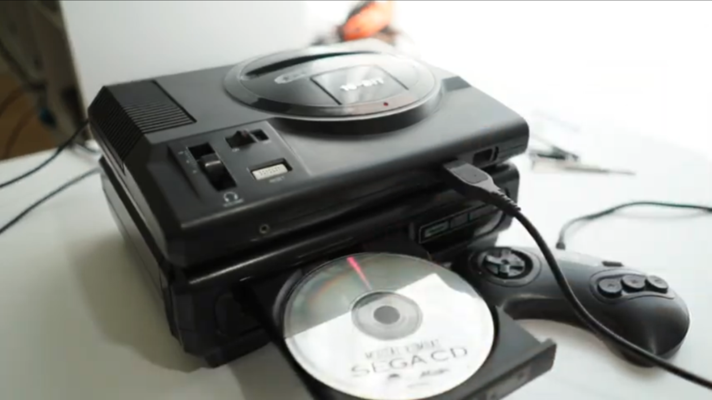
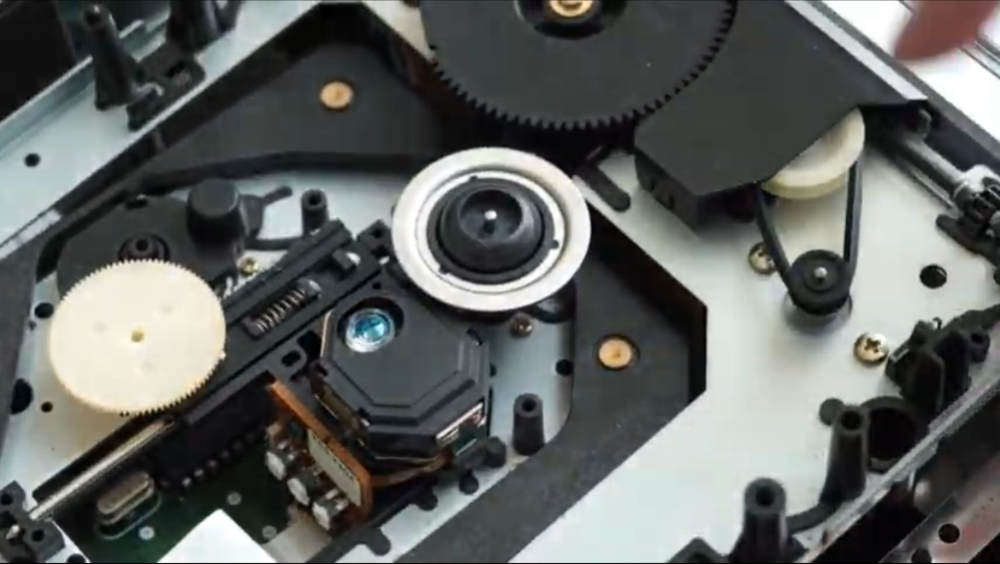
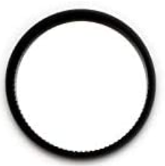

#### Descripción del problema

##### No abre la bandeja o charola para recibir cd's

Este problema es común , no solo en consolas de videojuegos basadas en recibir los discos con un mecanismo de bandeja, si no también en otros dispositivos de reproducción de este medio óptico. Y es que al pasar de los años suele comenzar a fallar gradualmente la apertura de la bandeja.

##### Diagnóstico y reparación de la falla CD TRAY en Sega CD modelo 1

Este problema del mecanismo al ser tan común se ha documentado que una de las causas que lo ocasiona suele ser la banda elástica. Y lo recomendable es reemplazarla por una nueva. Para ello se desarma la unidad removiendo los 6 tornillos Phillips de la base y los 2 que se encuentran en el socket conector que lo une con la consola Sega Genesis. Justo en el conector, se separa ligeramente la carcasa y se levanta totalmente, removiendo cuidadosamente la pestaña deslizable en el lado opuesto del conector en la consola Sega CD.

Ahora ya sin la carcasa, remover la lámina protectora de la unidad láser quitando 3 tornillos. Lo siguiente es quitar el sujetador de discos que viene atornillado directamente sobre la charola.

Al revisar el equipo se detecta que se encuentra desajustado el mecanismo de engranes que permite levantar el lector láser al momento de introducir un CD.
Para ajustarlo basta con llevar la charola hasta el fondo (cerrar la unidad) y con un desarmador de punta plana, mover manualmente el engrane más grande que sobresale del hueco que deja la charola hasta hacer que el lector suba a su máxima posición de lectura de discos.

Al comprobar el funcionamiento de la unidad, se detecta que sigue sin mantenerse cerrada la charola lo que imposibilita la reproducción de discos.

Revisando nuevamente la consola, y buscando información sobre nuestro problema, encontramos en el siguiente [video](https://youtu.be/S-uTIwtnngc) un caso documentado que indica que es una falla común y se debe a que la banda de goma que hace girar el mecanismo de engranajes de la charola se encuentra deteriorada. Es decir que ha perdido su elasticidad y forma.

Para llegar a la banda debemos quitar la charola removiendo el pequeño “tope” que está sujetado por una pestaña en el extremo derecho del fondo de la charola. Y deslizando en ambos lados, clips plásticos que evitan que la charola se deslice hasta salir de su riel. Posteriormente se quita una pequeña cubierta de plástico que protege los engranes y especialmente la banda de goma. Para quitarla hay que levantar la pestaña que lo sujeta a la unidad y desplazar ligeramente hacia la izquierda y jalar hacia arriba. Una vez hecho lo anterior tenemos acceso directo a la banda de goma. 

Al revisar en  nuestro equipo, detectamos que efectivamente la banda ha perdido su forma. Por lo que hacemos el reemplazo de con una banda nueva que podemos conseguir haciendo una búsqueda por sitios de subastas o también pueden utilizar una banda de alguna unidad DVDRW de PC verificando previamente que sea del mismo tamaño.

Hay quienes recomiendan remover la banda y meterla en agua hirviendo durante algunos minutos para que la goma recupere su propiedad elástica y su forma circular original, pues con el paso de los años son propiedades que ser pierden, haciendo la banda ovalada y reseca, lo que ocasiona que patine o se deslice sobre los anillos que la sujetan haciendo que la unidad no pueda abrir la bandeja.

Ahora cerramos la unidad siguiendo los pasos inversos que utilizamos para abrirla. Probamos y efectivamente la charola se mantiene cerrada y al meter discos ya no se abre y cierra constantemente. Ahora detecta el disco inmediatamente y funciona perfectamente.

###### @Spacemx

