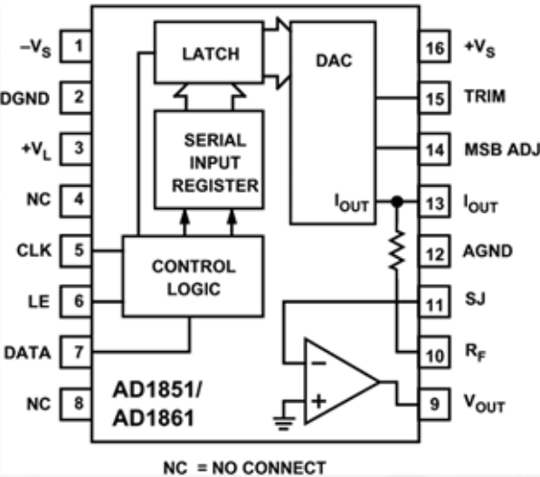

#### ÍNDICE
1. [Características de la PCB](#id1)
2. [Descripción del problema](#id2)
3. [Diagnóstico](#id3)
4. [Ajuste de volumen](#id4)
5. [Alimentación y conexiones en puerto JAMMA](#id5)
6. [Pruebas en la tarjeta de sonido](#id6)
7. [Amplificador de audio TDA7240A](#id7)
8. [Convertidor digital analógico AD1851](#id8)
9. [Probador de audio con amplificador LM386](#id9)
10. [Diagrama esquemático en etapa de audio analógico DAC AD1851A--> TL084 --> TDA7240A](#id10)

#### Características de la PCB
* Modelo PCB: Wolf unit
* Título: Mortal Kombat Ultimate
* Revisión del software: 1.0
* Desarrollada por: Midway Manufacturing, Noviembre 3, 1995 (R) 

#### Descripción del problema

Al conectar la PCB no se recibe sonido alguno, es decir no tenemos música ni voces y efectos. Sólo se escucha un zumbido. Hay que mencionar que la reparación también aplica para la PCB Mortal Kombat 3 ya que es la misma Wolf Unit que utiliza Ultimate Mortal Kombat
[plugin:youtube](https://www.youtube.com/watch?v=5rkIjWrkW0o)

#### Diagnóstico

Como es habitual, lo primero que debemos hacer es verificar lo más simple y que pudiera parecer obvio, pero en ocasiones puede ayudarnos a solucionar el problema. Y me refiero a las recomendaciones que vienen en el propio manual del operador para Ultimate Mortal Kombat 3, el cual cabe mencionar comparte “hardware” Wolf unit PCB con Mortal Kombat 3.

##### Test Menu

##### Ajuste de volúmen
La primera es “ajustar el volumen”. Lo cual podemos hacer desde el Test Menu del propio juego, para lo cual debemos activar el primer interruptor del Dip Switch 1 ubicado en la propia PCB

##### Alimentación y conexiones en puerto JAMMA
La segunda acción que debemos revisar es la conexión de las bocinas en el puerto jamma (pines L y #10) además de confirmar alimentación de +12v en pines F y #6, y de -5v en pines E y #5 del conector jamma.

##### Pruebas en la tarjeta de sonido
La tercera opción es ejecutar las pruebas de sonido que se incluyen en el Test Menu del propio juego. Con la “general test” se puede determinar el tipo de falla dependiendo de la cantidad de tonos que se escuchen. Los detalles se pueden analizar en la misma prueba y se ven a continuación.

De esta última prueba determinamos que nuestro caso se encuentra en “Check Hardware”, pues no escuchamos tono alguno al ejecutar la “General test”

##### Amplificador de audio TDA7240A
Para diagnosticar nuestra falla de hardware comenzamos a revisar la etapa de sonido, iniciando por la salida analógica del amplificador de audio. En este caso se trata de un TDA7240A de 7 pines donde pin#3 es la entrada sin amplificar y al medir con osciloscopio notamos que solo hay ruido, consecuentemente la salidas amplificadas en pin#5 y pin#7 también detectamos señales de ruido.

##### Convertidor Digital Analógico DAC AD1851
Ahora regresamos al origen de la propia señal analogica, la cual surge del convertidor digital analógico DAC AD1851 dip16 en pin #9 y tampoco vemos actividad en el osciloscopio, sólo una ligera muestra de ruido. Debido a esto revisamos las entradas de señales digitales en este mismo elemento pines #5(CLK), pin#6(Latch) y pin#7(Data). Donde afortunadamente si obtenemos señales digitales claras. Obviamente también revisamos las terminales de alimentación y tierra. Cabe mencionar que este componente en particular hace uso de la alimentación (-5v) en -Vs muy común en PCB’s Mortal Kombat, NBA JAM y otras de Midway. Por lo que si la fuente de poder no tiene esta característica, entonces no podremos escuchar el sonido.

##### Probador de audio con amplificador LM386
Para comprobar si hay audio en etapas de sonido preamplificadas, es decir antes de pasar por el amplificador de poder de la PCB, podemos usar un amplificador de audio externo a la placa que nos ayude a escuchar señales povenientes directamente del DAC (convertidor digital-analógico) y de otros componentes previos a llegar al amplificador TDA7240A.

Una opción de amplificador externo es usando un LM386 en una configuración como la que se muestra en el diagrama siguiente:

En la imagen anterior 
* Vin es la entrada para nuestra señal de audio proveniente del punto de prueba que analizaremos
* Vs es la alimentación +12Volts
* Bypass cap es de 10uF
* Bocina de 2watts y 8ohms

Ahora regresando al análisis de nuestra PCB, podríamos pensar que nuestro DAC está fallando, pero al analizar pin#9 con nuestro probador de audio con amplificador LM386 notamos que si tenemos audio de juego, lo que supone que nuestra falla no se encuentra en el DAC[ AD1851](https://www.analog.com/en/products/ad1851.html). Lamentablemente en esta ocasión no aparece esta sección de sonido en el diagrama esquemático de MK3/UMK3 que nos guíe con las conexiones entre componentes. [**MK3_arcade_schematics**](http://wiki.pldarchive.co.uk/images/8/8b/UMK3.pdf) [**Mortal Kombat 3 manual**](http://www.aurcade.com/games/manuals/00000146.pdf)

##### Diagrama esquemático en etapa de audio analógico DAC AD1851 → TL084 → TDA7240A
Afortunadamente existe el diagrama esquemático de Mortal Kombat 2, del cual sabemos que utiliza el mismo DAC en la etapa de sonido y al hacer mediciones vemos que se tienen grandes similitudes entre ambas placas. Aquí parte del diagrama en la tarjeta de sonido de MK2 con algunas anotaciones nuestras.

Analizando PCB y diagrama encontramos que pin#9 se encuentra conectado directamente al #10 del AD1851, y de la misma manera los las terminales #11 y #13 también están interconectadas entre sí.

Ahora hacemos el seguimiento de la ruta que sigue la señal analógica emitida por la salida de terminales #9 y #10 hasta llegar al amplificador TDA7240A y finalmente a pines L y #10 del puerto jamma.

Resultado de esta búsqueda encontramos que [TL084](https://pdf1.alldatasheet.com/datasheet-pdf/view/177125/TI/TL084.html) (un grupo de 4 amplificadores operacionales),  recibe la señal analógica de salida del DAC AD1851 y ésta sigue la ruta como se observa en la imagen anterior. Tras pasar por algunos elementos pasivos (resistencias y capacitores) ingresa por terminal #10 y sale por #8, posteriormente la señal sigue su camino por terminal #12 y sale por #14, después entra por pin #3 y sale por #1 y finalmente ingresa a pin#5 y sale por #7. De dónde se dirige al amplificador  TDA7240A. Durante todo este proceso pasa por diversos filtros capacitivo-resistivo.

Con este rastro analizamos con nuestro probador de audio en cada una de las entradas y salidas de los amplificadores operacionales dentro del TL084 y detectamos que  en las primeras 2 etapas tenemos señal de audio clara, pero al llegar al tercer “OpAmp” (pines de entrada #3 y salida en #1) la señal viene con mucho ruido y la sonorización del juego es casi imperceptible, de la misma manera al llegar al último operacional simplemente a su salida se tiene el ruido que finalmente se amplifica mediante el [TDA7240A](https://pdf1.alldatasheet.com/datasheet-pdf/view/25072/STMICROELECTRONICS/TDA7240A.html).

Afortunadamente tenemos en stock un TL084 nuevo y antes de reemplazarlo hacemos “piggyback” sobre el sospechoso de falla y como podemos escuchar en el video ya recuperamos completamente el audio del juego.
[plugin:youtube](https://www.youtube.com/watch?v=CT4pnMyEAOI)

Entonces ya con el culpable de la falla ubicado, solo resta hacer el cambio con su respectivo socket dip@14 y una vez más ejecutar las pruebas de diagnóstico de la propia PCB para confirmar el correcto funcionamiento.

[plugin:youtube](https://www.youtube.com/watch?v=640GOFHKMm8)

###### @Spacemx