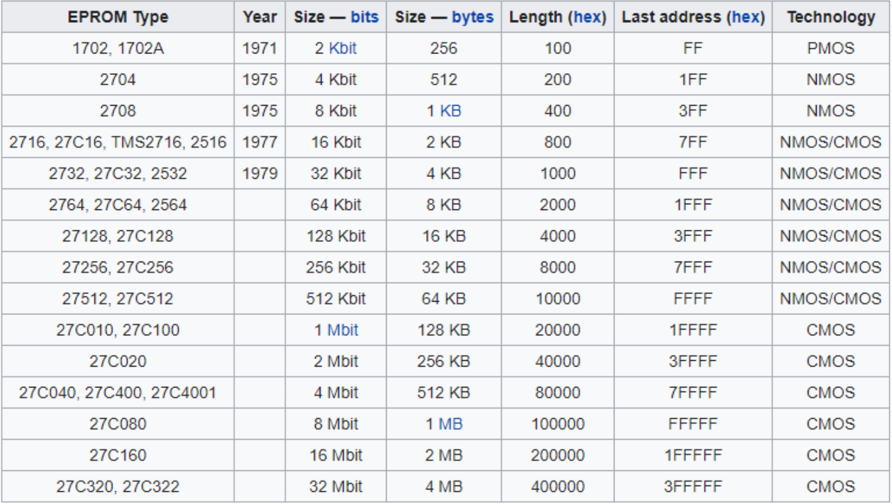
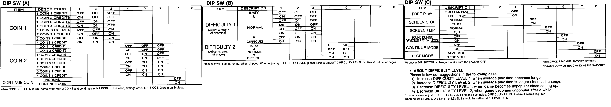

    #### ÍNDICE
1. [Características de la PCB](#id1)
2. [Descripción del problema de sincronía](#id2)
3. [Diagnóstico y reparación de la falla de sincronía](#id3)
4. [Descripción del problema de gráficos](#id4)
5. [Diagnóstico y reparación del problema de gráficos](#id5)
*  [¿Cómo identificar nuestra versión de PCB?](#id6)
*  [Dump de ROMS e identificación de eproms compatibles](#id7)
*  [Identificando secciones en bootleg PCB Carrier Air Wing (cawingbl)](#id8)
*  [Memoria RAM de objetos](#id9)
*  [Configuración DIP SWITCH](#id10)
*  [Falla de color en algunas gráficas y el juego se congela en escenario 8](#id11)
    
===
#### Características de la PCB
* Título: Carrier Air Wing "bootleg"

La PCB **Carrier Air Wing** corresponde a la versión “**BOOTLEG**” basada en el juego original desarrollado por CAPCOM en 1990 para su plataforma Capcom Play System CPS-1

Esta versión se encuentra emulada en MAME bajo el driver [fcrash.cpp](https://github.com/mamedev/mame/blob/master/src/mame/drivers/fcrash.cpp) que fue desarrollado para Final Crash una versión bootleg de Final Fight. 

De acuerdo a MAME existen 2 versiones de Carrier Air Wing Bootleg en este driver (set 1 y set 2), de ahí obtenemos que por la cantidad de ROMs nuestra versión corresponde al set 1 (CAWINGBL). Pues solo se cuenta con 2 roms de programa 4 para gráficos y uno de audio. El set se compone de 2 PCB 's interconectadas mediante conectores IDC planos.

#### Descripción del problema de sincronía
Se realiza una revisión para determinar si alguna de las placas tiene algún daño evidente que ponga en riesgo la integridad del juego al momento de energizarlo, principalmente que no tenga un cortocircuito entre los puntos de alimentación del puerto jamma. Afortunadamente no detectamos ningún problema grave y solo realizamos mantenimiento preventivo/correctivo al puerto JAMMA , debido a que presentaba mucha suciedad y los conectores de alimentación de energía y de las señales de salida RGB Sync, tenían exceso de soldadura, suponemos, con la finalidad de mejorar su conductividad y aumentar su espesor para lograr tener un mejor contacto con el conector JAMMA.

Tras la limpieza por fin energizamos el equipo y detectamos que el juego funciona y aparentemente se escucha bien, pero detectamos problemas con la imagen, aparentemente con la señal de sincronía, ya que no obtenemos imagen estable en pantalla.

#### Diagnóstico y reparación de la falla de sincronía
Al revisar con osciloscopio el pin “P” del puerto jamma se mide una frecuencia de 14.2 kHz cuando se supone debería ser aproximadamente de 15.6kHz.

Debo mencionar que al investigar un poco sobre esta versión de PCB bootleg encontramos que en este mismo hardware se ejecuta una versión copia de Final Fight, juego de CAPCOM para la plataforma CPS1.

Con esto en mente hacemos búsqueda de bitácoras de reparación para este mismo hardware y encontramos que Final Crash (una versión pirata de Final Fight) corre bajo esta misma plataforma. 

Entonces buscando reparaciones de Carrier Air Wing Bootleg ó Final Fight Bootleg  dimos con un [foro](https://forums.arcade-museum.com/threads/final-crash-final-fight-bootleg-repair-need-help.402377/) donde se tiene un problema de sincronía en el juego. El problema se soluciona al instalar el reloj cristal del valor correcto que permita medir en pin 15 del CPU MC68000 10 MHz  y la señal de sincronía cercana a 15.6kHz. En nuestro caso tenemos 10 MHz en el pin#15 del CPU pero en pin “P” del puerto jamma (sincronía) se detecta una frecuencia de 14.2kHz, lo cual es una señal insuficiente y por ende no compatible con la mayoría de monitores CRT  o escaladores.

Recordar que un  valor  correcto de sincronía se encuentra cercano a  los 15.6kHz, en este mismo “[hilo del foro](https://forums.arcade-museum.com/threads/final-crash-final-fight-bootleg-repair-need-help.402377/)” se indica que la sección del CPU utiliza un cristal y otro que genera señales de video sincronía. En nuestro caso el cristal cercano al CPU MC68000 es uno de 20MHz y el encargado de la sección de video es de 27.09MHz. 

Otro punto a considerar es que en algunas PCB bootleg no tienen propiamente aterrizada la señal de Video Ground lo cual puede ocasionar distorsión en las señales  de video. En mi caso la señal de video ground si está aterrizada.

En la publicación de este foro, se concluye que el segundo cristal X2 en la PCB (el más alejado del CPU ) tiene un valor incorrecto que ocasiona una señal de sincronía vertical baja con respecto a los estándares. Nosotros obtenemos frecuencia de 14.22 kHz y al cambiar el cristal X2 por uno de menor valor (24 MHz)  la frecuencia bajó a 12.3 kHz y al reemplazarlo por uno de 16 MHz la sincronía cayó a 8.3kHz. 

Mediante una sencilla operación matemática, logramos determinar que 30 MHz es un valor adecuado del cristal para consolidar 15.62kHz aproximadamente, la cual es compatible y adecuada para la gran mayoría de monitores CRT y escaladores.

* Frec.Sync deseada = 15.6kHz
* Frec. del cristal oscilador instalado = 27.09MHz
* Frec. Sync con oscilador de 27.09MHz = 14.22kHz
* Frec. del cristal oscilador para obtener  Sync de 15.6kHz = x

Multiplicando la frecuencia que queremos obtener (15600 Hz) por la frecuencia del cristal instalado (27090000 Hz) y el resultado lo dividimos entre el valor de frecuencia que emite actualmente la sincronía (14220 Hz) 
(15600)(27090000)/14200 = 29 718 987 ⇒ 29.71 MHz 
entonces elegimos el valor comercial más cercano (que pudimos conseguir) para el cristal y resultó ser de 30 MHz.

Al instalar el reloj de 30MHz, por fin tenemos señal de sincronía correcta.

#### Descripción del problema de gráficos
Al recuperar la sincronía del video podemos ver que en pantalla aparecen algunos objetos, letras y tiles duplicados o en lugares erróneos, tal y como se aprecia en las imágenes siguientes.
[plugin:youtube](https://www.youtube.com/watch?v=Rd4nY1GANT0)

#### Diagnóstico y reparación de problemas gráficos
Esta falla parece indicar un problema con las memorias que se encargan de desplegar las gráficas de objetos (OBJ RAM) y posiblemente también de los fondos (SCROLL RAM), aunque en la prueba de autodiagnóstico de la PCB indica que se encuentran en estado OK.
[plugin:youtube](https://www.youtube.com/watch?v=h1V18hLoirA)
Como es de esperar, la PCB bootleg no cuenta con diagrama esquemático, motivo por el cual no es fácil la identificación de las etapas de funcionamiento del juego. Sólo tenemos como referencia la PCB original CAPCOM CPS1, que cabe mencionar no se parece físicamente a la bootleg y por lo tanto no podemos guiarnos para ubicar las secciones en nuestra bootleg. 

Buscamos en MAME el driver con el cual funciona esta versión bootleg para revisar cuales juegos funcionan también con ese driver. De esta manera podemos buscar por internet documentación acerca de la PCB con cualquiera de esos juegos.

##### ¿Cómo identificar nuestra versión de PCB?
También con MAME podemos ver exactamente a cuál versión pertenece nuestra PCB. A decir por la cantidad de EPROMs en la PCB estamos seguros de que nuestra versión es cawingbl (set 1). Otra manera de averiguar la versión es mediante la lectura de información que contienen las mask rom del programa CAW1 y CAW2 e identificar con mame -romident.

Dichas memorias de sólo lectura se encuentran ubicadas cerca del CPU 68000 en la posición que indica la siguiente imagen.
* GU-1001BP → CAW1
* GU-1002BP → CAW2

Las memorias de almacenamiento ROM para gráficos que utiliza la placa bootleg también son MASK ROMs identificadas con una clave  GU-1007BP, GU-1006BP, GU-1005BP, GU-1003BP y su encapsulamiento es dip32 de 512KB. El tipo de memoria que debemos seleccionar en nuestro programador de eproms es 27C040. El cual corresponde a la misma capacidad y configuración de pines de las mask roms instaladas en la PCB bootleg.

##### Dump de ROMS e identificación de eproms compatibles
Al tener un problema de gráficos comenzaremos por descartar falla en las ROMS, para ello desoldamos las mask roms de gráficas, leemos su información con el programador de eproms e identificamos con mame como sigue:
* GU_1003BP ---> caw4.bin
* GU_1005BP ---> caw5.bin
* GU_1006BP ---> caw6.bin
* GU_1007BP ---> caw7.bin

todos fueron reconocidos correctamente por mame -romident. En caso de que alguna memoria de almacenamiento no sea reconocida se debe hacer el reemplazo. Y la eprom compatible que puede utilizarse es la 27C040/27C4001 de 512KB.

En algunas PCB’s no es fácil identificar el modelo de eprom compatible, menos si no se puede leer la nomenclatura de la propia ROM o si se trata de una MASK ROM con etiqueta de identificación personalizada muy distinta  a la que originalmente usó el fabricante.

Para estos casos podemos revisar en MAME la longitud (capacidad) máxima en hexadecimal del rom, en este caso (0x80000) y con este dato ubicar en la tabla siguiente los valores compatibles. En la tabla se indica 27C040, 27C400, 27C4001 4 Mbit 512KB. Y el otro dato importante es contar el número de pines que tiene la MASK ROM. Por ejemplo para caw6.bin es de 32 pines.

##### Identificando secciones en bootleg PCB Carrier Air Wing (cawingbl)
Al descartar falla en nuestras ROMS de gráficas comenzamos a medir y trazar un diagrama simple de nuestra placa para lograr identificar las etapas de funcionamiento de la PCB. Por ejemplo la sección de ejecución de programa (CPU, EPROMS de programa y RAM principal), la de video (GPU o procesador de video, EPROMS de gráficos y objetos, RAM de video, RAM de color), por el momento no daremos seguimiento a la sección de audio ya que nuestro enfoque actual es el de corregir las fallas de video.

Para ello podemos comenzar con los componentes que identificamos claramente por su nomenclatura. Por ejemplo para analizar nuestra sección de video podemos comenzar por seguir el rastro desde el puerto JAMMA (RGB) hasta llegar a las mask roms de gráficas.

Ubicamos pines N, 12 y 13 y seguimos su rastro de las pistas para encontrar los circuitos de donde provienen las señales y así vamos reconociendo las etapas y dibujando nuestro diagrama.
De esta manera llegamos a identificar algunos elementos y su función.

NOTA: Un detalle que puede dificultar la búsqueda de fallas en PCB’s bootleg es que, en ocasiones, por diseño algunas pistas o pines de componentes son cortados deliberadamente.  Y en esta placa Carrier Air Wing Bootleg he encontrado este detalle más de 4 veces.  El problema está en que al no saber si es una falla o un corte deliberado, y al tratar de seguir el rastro de la pista no encontramos pruebas concluyentes, debemos asumir que es una falla y al corregir, el juego empeora. Por lo cual es difícil saber cuando se trata de un corte “por diseño” o por accidente. 

##### Memoria RAM de objetos
Tras identificar algunas etapas, pudimos revisar las memorias ram que despliegan los objetos en pantalla. Se trata de un par de memorias RAM 62256 SRAM  las cuales por diseño reciben las mismas direcciones de memoria (address memory) y al medir las líneas de dirección notamos que en una de ellas el pin#7 (A3) no estaba recibiendo señal, permanecía constantemente en estado lógico bajo. 

Revisando las pistas de cada una de las líneas de dirección notamos una falta de continuidad en el pin#7. Al revisar con detenimiento, notamos un poco de oxido exactamente en la unión entre el pin de la RAM 62256 y la pista de conexión. Por lo tanto, limpiamos y agregamos un pequeño hilo de cobre para corregir la falta de conectividad.

Tras la reparación energizamos la PCB para revisar si hubo algún cambio y afortunadamente los problemas gráficos desaparecieron. Ahora no vemos textos repetidos ni tampoco objetos fuera de lugar.

Para comprobar que todo esté bien, jugamos por unos minutos, pero notamos que al perder, el juego no permite continuar a lo cual suponemos que se trata de una configuración de la pcb (dip switch).

##### Configuración DIP SWITCH
Investigando la configuración de los 3 dip switch  para este juego, en el [manual del operador](https://www.arcade-museum.com/manuals-videogames/C/Carrier%20Airwing.pdf) de  la versión [original de capcom](https://www.arcade-museum.com/manuals-videogames/C/carrier_airwing.pdf), vemos que efectivamente existe la opción de Continue, tal y como aparece en la imagen siguiente.

El problema que tenemos ahora, es que en nuestra PCB Carrier Air Wing bootleg vienen  identificados los 3 dip switch como 1, 2 y 3 , cuando en la PCB original se indican como A, B y C. Supusimos de primera instancia que 1 corresponde a A, 2 a B y 3 a C, pero al tratar de ingresar al menu de pruebas (test menu) no pudimos entrar. Incluso no lo logramos desde el botón del puerto jamma, pues revisando vemos que el pin correspondiente a “test” no se encuentra conectado a nada en la PCB, es decir está flotando por así decirlo.

Entonces la identificación correcta de los 3 dip switches de nuestra PCB con respecto a la placa CPS1 original es que 
* 1 corresponde a C
* 2 corresponde a B
* 3 corresponde a A

Entonces configuramos ahora nuestros dip switches e ingresamos a test. Aquí encontramos diversas opciones para calibrar la pantalla, probar los “inputs” (botones y joystick), sound test y también podemos ver de manera gráfica la configuración que se tiene en los 3 dip switches, permitiendo ver en tiempo real los cambios que ocasiona activar alguno de ellos.

Fue aquí donde detectamos que el switch #6 del dip switch C ( en nuestro caso 1) corresponde a “Continue” y vemos que tiene un pequeño falso contacto, pues al deslizarlo hasta el fondo para activarlo, cambia de “off” a “on”, pero finalmente vuelve a cambiar a “off”. Aplicamos alcohol isopropílico en abundancia para tratar de solucionar el problema, pero lamentablemente persiste.
Afortunadamente notamos que al deslizarlo solo un poco sin alcanzar el tope del switch, se activa correctamente y se mantiene en estado “on” , de esta manera pudimos probar el juego temporalmente hasta que reemplacemos el dipswitch. Al probar el juego, efectivamente ya pudimos cambiar dificultad, créditos y también ya pudimos continuar al perder.

##### Falla de color en algunas gráficas y el juego se congela en escenario 8
En este momento supusimos que los problemas habían terminado, pero durante nuestro juego notamos que al ir avanzando por las escenas el personaje con barba gris que aparece en la pantalla de selección de disparos y bombas y que vemos antes de iniciar una nueva escena, comienza a mostrar un error en el color de su barba, pues se ve color verde.

Lo extraño es que en las primeras 4 o 5 escenas el personaje se ve correctamente, es hasta las escenas 6 y 7 cuando comienza a cambiar de color la barba y cabello. Por lo cual no aparenta ser problema de la memoria ram de video color o de la ram de objetos, pues la falla se presentaría desde la primera escena hasta la última. Falla en las eproms de gráficos la podemos descartar, ya que pudimos hacer el dump de los 4 y comprobamos con romident de mame. 

La causa puede ser debido a una pista de conexión con problemas de continuidad, ya sea por corrosión, óxido o un corte, también se puede dar el caso de tener soldadura fría en alguna patita de las memorias de video o componentes circundantes de esta etapa.

Otro problema que también detectamos es que el juego se congela justo antes de iniciar la escena 8. Se queda en una pantalla roja/café con los menúes listos para iniciar la escena 8 y se logra escuchar el sonido que indica que se agregó un crédito. El juego no avanza y tenemos que resetear.

Por lo tanto hacemos dump de mask roms de programa, es decir caw1 y caw2 las cuales se encargan del código con el juego propiamente. Al identificar los ROMS con MAME notamos que en primera instancia no son reconocidos lo cual indicaría que debemos grabar nuevos eproms 27C040 / 27C4001 4Mb DIP32 EPROM. Pero para confirmar volvemos hacer la lectura de las ROMS y comparamos con mame y en este segundo intento fueron reconocidos correctamente. Lo que indica posible suciedad al leer los ROMS la primera vez. Por este motivo recomiendo limpiar correctamente las EPROMS previo a su lectura con el programador y hacer al menos 2 intentos para confirmar los datos.

Este comportamiento sugiere falla en la lectura de los datos de programa, pero no directamente de las EPROMS, pues ya se confirmó que no tienen problema. De cualquier modo se graban nuevos EPROMS en 27C4001 y la falla permanece. Entonces  debemos revisar falta de continuidad entre las ROMS , RAM y CPU.

Tras la revisión de continuidad en las memorias RAM, también revisamos nuevamente las RAM de objetos (2x62256) y sorpresivamente al probar el juego, por fin avanzó mas allá del stage 8 y pude terminar el juego, aunque la última escena, y la pelea final mostraron varios errores gráficos tanto en escenarios como en objetos. Lo que supone continuar con la revisión.

continuará . . .

###### @Spacemx