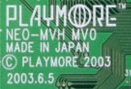
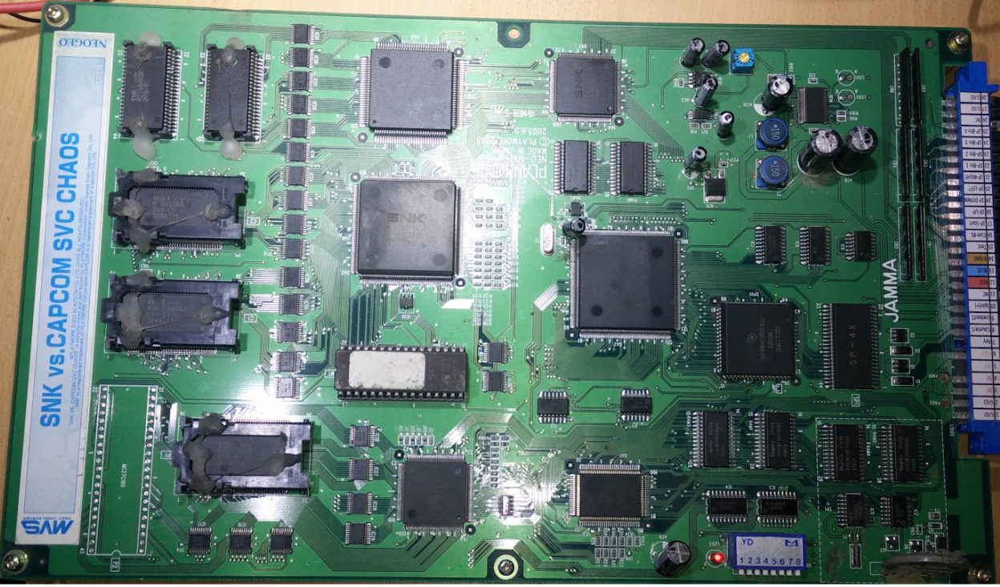
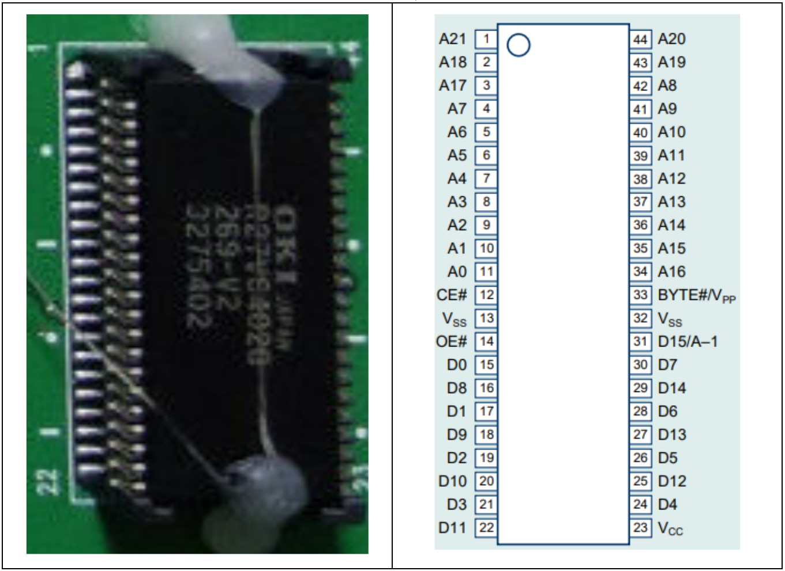
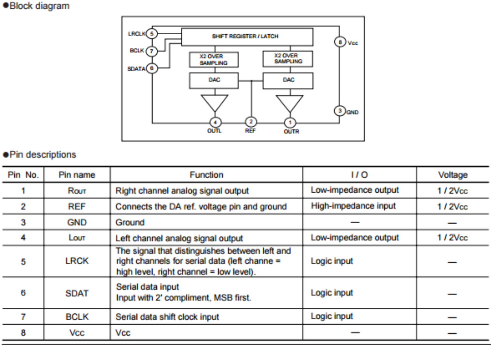
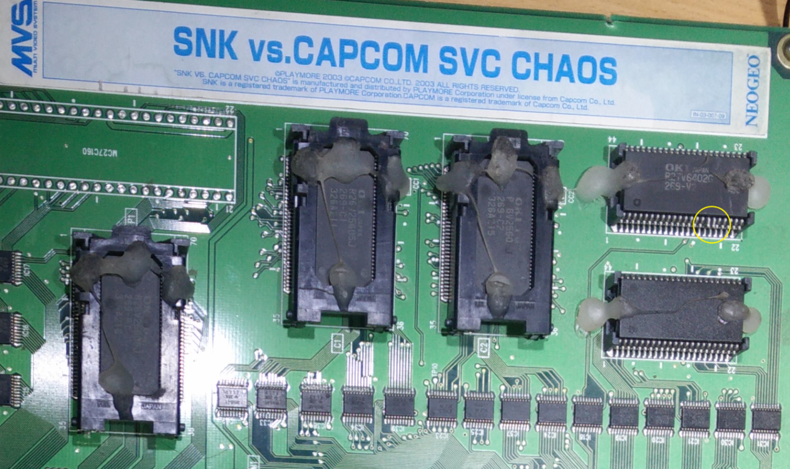

#### ÍNDICE
1. [Características de la PCB](#id1)
2. [Descripción del problema](#id2)
3. [Diagnóstico y revisión](#id3)
4. [Reparación del problema de video](#id4)
5. [Reparación del problema de sonido](#id5)

===
#### Características de la PCB
* Título: SNK vs Capcom Chaos
* PCB: PLAYMORE&trade; NEO-MVH MVO
* &copy;PLAYMORE 2003

El juego se recibe bajo la condición de tener fallas en el departamento gráfico, y según palabras del propio vendedor, el problema se soluciona presionando sobre el único EPROM en la PCB. Lo cual pudiera parecer un problema sencillo de reparar. Otro inconveniente que se tiene es el ruido en la salida de audio, a lo cual no se tiene un diagnóstico por parte del vendedor.

#### Descripción de problemas
Tras revisar de manera visual sobre posibles problemas potenciales que pongan en riesgo la PCB , encendemos el equipo y se confirman ambos problemas descritos con anterioridad. Además también se suma el problema de cambiar la batería recargable, pues con seguridad debe tener carga baja o nula tras más de 15 años en operación.

#### Diagnóstico y revisión
Tras revisar de manera visual sobre posibles problemas potenciales que pongan en riesgo la PCB , encendemos el equipo y se confirman ambos problemas descritos con anterioridad. Además también se suma el problema de cambiar la batería recargable, pues con seguridad debe tener carga baja o nula tras más de 15 años en operación.

#### Reparación del problema de video
Se confirma la falla y método para solucionar problema en la señal de video, la cual se ve distorsionada. Al presionar sobre el EPROM el problema se reduce hasta eliminarse por completo, motivo por el cual se remueve el EPROM de su socket y se le da limpieza a ambos elementos, con la finalidad de eliminar el problema y afortunadamente así sucedió.

#### Reparación del problema de sonido

Al comprobar el problema de sonido en la PCB, notamos que aplicaba para música, voces y efectos de sonido, excepto el  sonido característico de la introducción Neo Geo, el cual se genera en un circuito diferente y no depende de los EPROM’s de sonido, que en este caso son memorias OKI R27V6402G 4M-word x 16-Bit o 8M-word x 8-Bit OTP

Primero revisamos la salida de audio directamente en el puerto jamma pin #10 y obtenemos la señal con ruido. Posteriormente no dirigimos al DAC - Convertidor Digital Analógico BU9480F con la finalidad de revisar si la salida de audio analógico en su punto inicial también viene con ruido, lo que supondría una falla en la etapa digital, ó si el ruido se crea después del DAC, lo que indicaría falla en la etapa analógica de nuestra PCB.

Resultado de nuestra medición con el probador de audio,  vemos que la señal analógica proveniente del DAC pines #1(channel Right) y #4(channel Left) ya vienen con ruido lo que nos obliga a revisar la etapa digital. Por tal motivo revisamos las entradas de datos en el propio DAC pines#5 - LR clock ,pin#6 - Serial Data, pin#7 - B clock y alimentación en pin #8 y GND en pin#3, pin#2 es Ref para las salidas en pines #4 - Out L y #1- Out R. 

Todo parece bien en ese punto, así que continuamos el análisis desde las rom de audio, memorias ram y procesador.

Una vez que comenzamos el análisis notamos que la memoria rom ubicada en la esquina superior derecha de la imagen tienen un par de pines levantados o fuera de socket. Se trata de pines #16 y #17, lo que según su “pinout” se trata de salida de datos D8 y D1 respectivamente.

En algunas PCB 's (mayoritariamente bootlegs) por diseño del fabricante, se anulan deliberadamente algunos pines de ciertos circuitos.

Antes de revisar el pinout de la memoria pensamos que este podría ser el caso. Pero al detectar que se trataba de salida de datos D1 y D8 , supimos que no era el caso, además de revisar múltiples fotografías de placas SNK vs CAPCOM SVC CHAOS en internet notamos que ninguna tenía esta característica, motivo por el cual re-insertamos ambos pines en su socket y afortunadamente el problema de sonido desapareció por completo. Con lo cual se da por terminada la reparación.

###### @Spacemx
